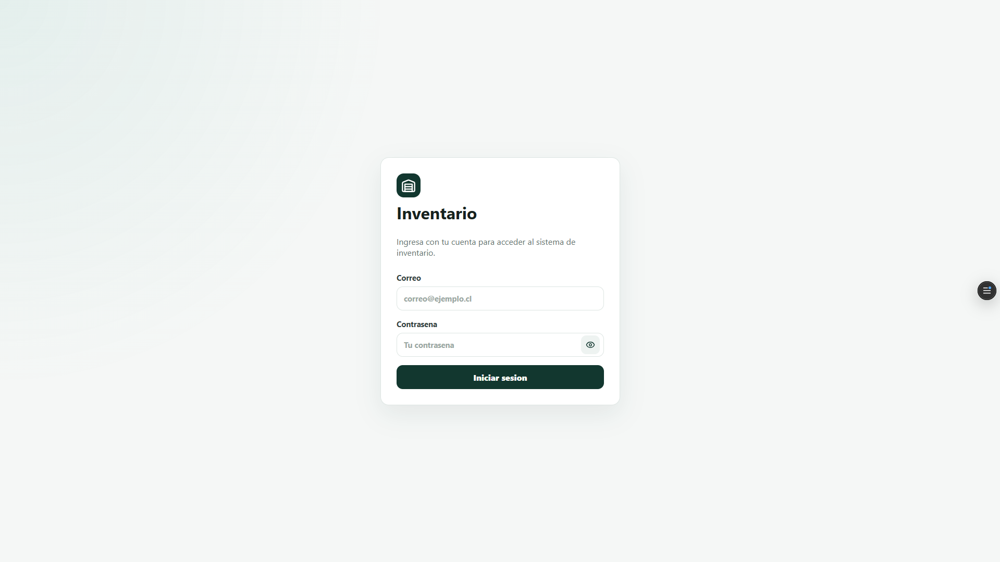
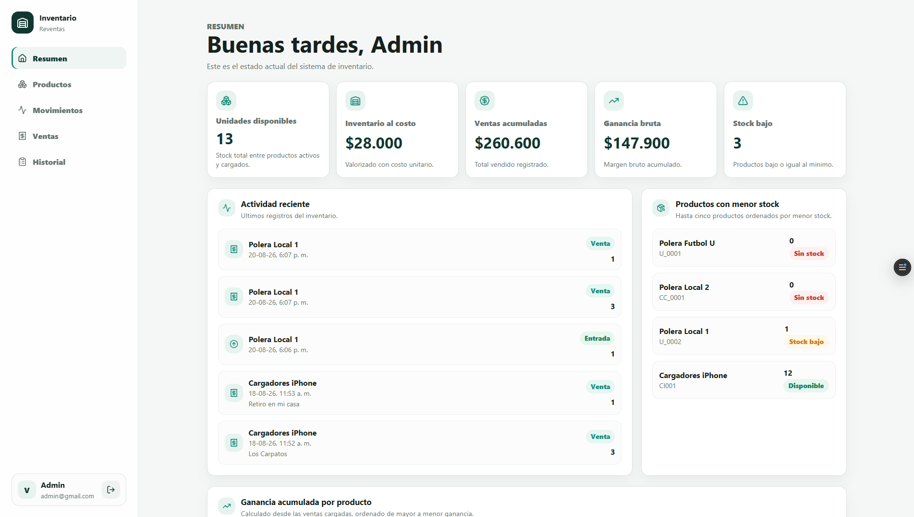
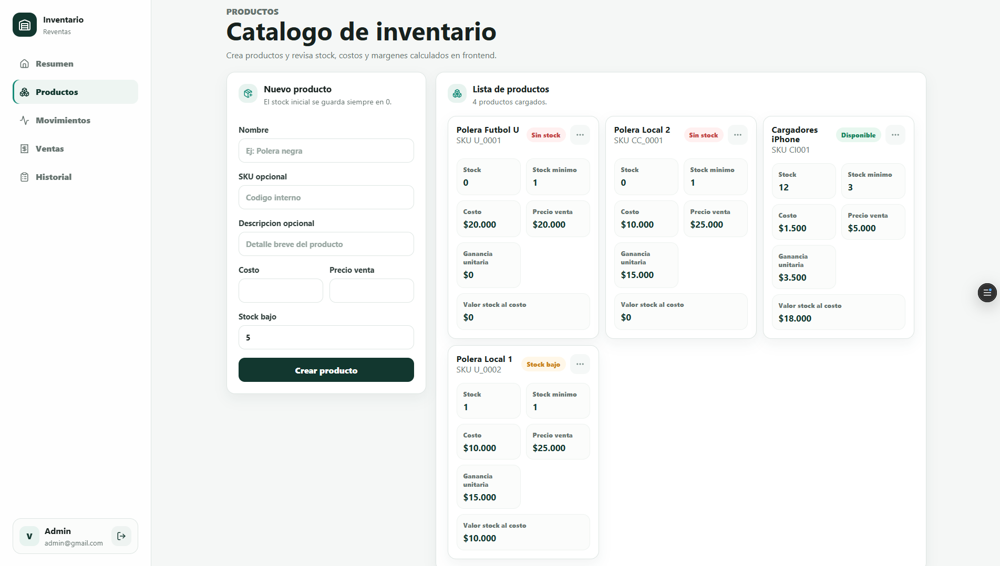
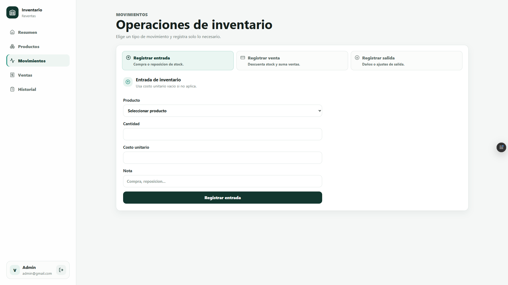
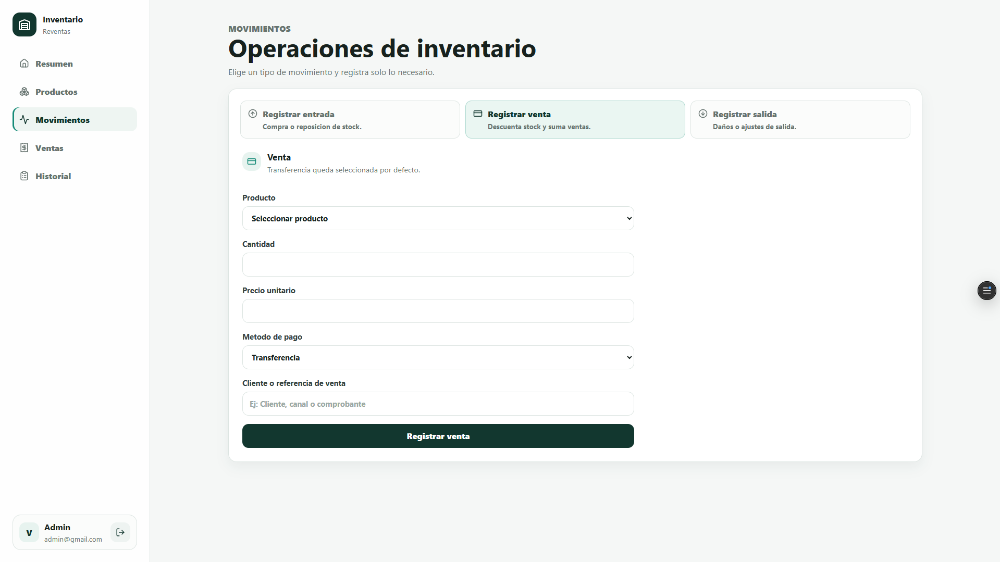
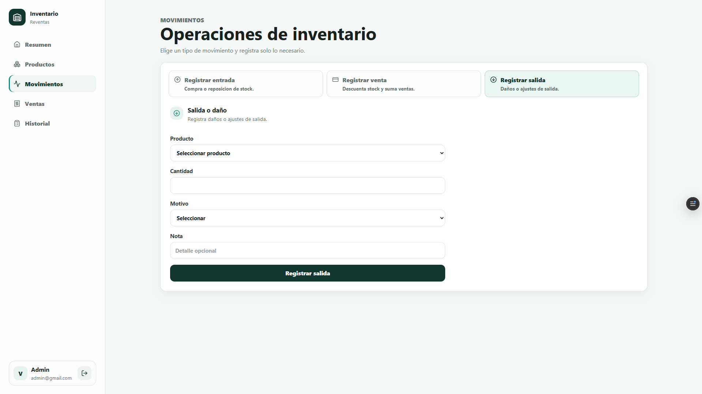
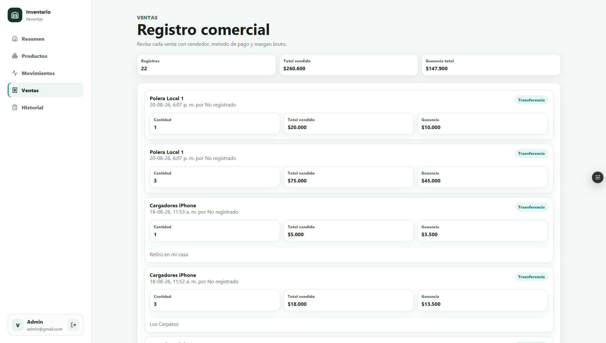
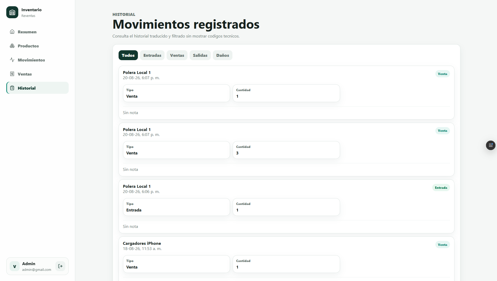

# Inventario

Aplicación web para gestión de inventario, ventas y movimientos de stock, pensada para pequeños negocios y operaciones de reventa.

El sistema permite administrar productos, registrar entradas, ventas y salidas, consultar el historial de movimientos y visualizar métricas comerciales desde un dashboard central.

## ✨ Funcionalidades

* Inicio de sesión mediante Supabase Auth.
* Dashboard con:

  * stock disponible;
  * valor del inventario;
  * ventas acumuladas;
  * ganancia bruta;
  * productos con stock bajo.
* Gestión de productos.
* Registro de entradas de stock.
* Registro de ventas.
* Registro de salidas y ajustes.
* Historial de movimientos.
* Consulta de ventas y ganancias.
* Visualización de productos con menor stock.
* Cálculo de ganancia por producto.
* Interfaz responsive y orientada a una gestión simple.

## 🛠️ Tecnologías utilizadas

* React
* Vite
* TypeScript
* Supabase Auth
* Supabase Database
* RPC de PostgreSQL

## 📸 Capturas

### Inicio de sesión



### Dashboard



### Gestión de productos



### Registro de movimientos







### Registro de ventas



### Historial



## 📁 Estructura general

La aplicación consume un backend ya configurado en Supabase y concentra el acceso a datos y los mapeos del esquema dentro de la capa `src/lib`.

Las tablas utilizadas son:

* `members`
* `products`
* `sales`
* `inventory_movements`
* `expenses`

También utiliza las siguientes funciones RPC:

* `register_stock_entry`
* `register_sale`
* `register_stock_output`

Los mapeos de columnas y variantes de argumentos RPC están concentrados en:

```text
src/lib/schema.ts
```

Esto permite adaptar el frontend a distintas variantes del esquema sin modificar la interfaz principal.

## ⚙️ Requisitos

* Node.js 20 o superior
* Proyecto de Supabase configurado
* Variables de entorno:

  * `VITE_SUPABASE_URL`
  * `VITE_SUPABASE_PUBLISHABLE_KEY`

## 🚀 Instalación

Clona el repositorio y entra a la carpeta del proyecto.

Instala las dependencias:

```bash
npm install
```

## 🔐 Configuración

Crea un archivo `.env.local` en la raíz del proyecto:

```bash
VITE_SUPABASE_URL=https://tu-proyecto.supabase.co
VITE_SUPABASE_PUBLISHABLE_KEY=tu_clave_publicable
```

Los archivos `.env` y `.env.local` se encuentran ignorados por Git.

## ▶️ Ejecución local

```bash
npm run dev
```

## 📦 Compilación

```bash
npm run build
```

## 🗄️ Supabase

La aplicación no crea ni modifica tablas, columnas, políticas RLS ni funciones de base de datos.

Consume una estructura de Supabase existente y utiliza funciones RPC para las operaciones críticas de inventario.

Si el esquema utiliza nombres diferentes para campos como nombre, stock, costo, precio o vendedor, los ajustes se realizan desde:

```text
src/lib/schema.ts
```

sin necesidad de modificar la UI.

## 📌 Estado del proyecto

Proyecto funcional utilizado como sistema web de gestión de inventario y reventas.

Actualmente se mantiene como proyecto de portafolio y demostración de desarrollo Full Stack con React, TypeScript y Supabase.

## 👨‍💻 Autor

Desarrollado por Vicente.